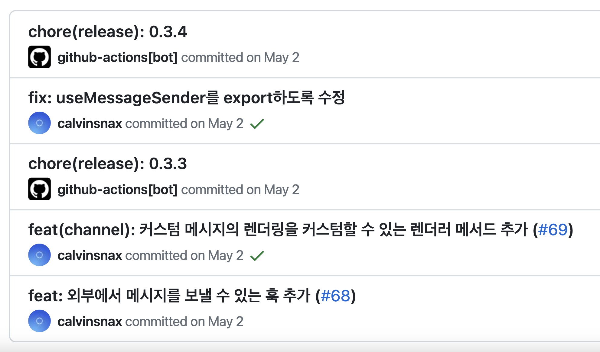
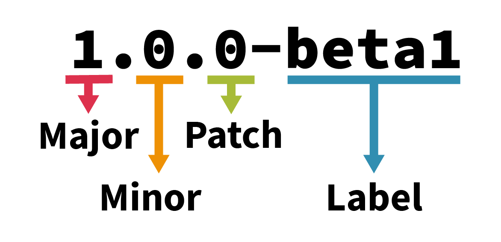

서비스가 성숙함에 따라 N개 이상의 프로젝트에서 공통적으로 사용해야 하는 코드들이 많아졌습니다. 대표적으로 UI 컴포넌트나 유틸리티 메서드 등을 들 수 있는데요. 기존에는 이 코드들을 개별적으로 관리했었습니다. 이는 [단일 진실 공급원(SSOT; Single Source Of Truth)](https://www.lesstif.com/software-engineering/ssot-single-source-of-truth-128122887.html)이라는 방법론에는 맞지 않는 방식인데요. 저는 이 코드들을 통합하고 서비스 개발환경으로부터 완전히 독립적인 사내 라이브러리를 만들기로 했습니다.

사내 라이브러리는 NPM으로 관리할 수 있어야 하며, 사내 개발팀만 접근할 수 있는 비공개 저장소에 위치해야 하는데요. 저희는 사내 라이브러리를 빠르게 도입해보는 것이 우선적이었기 때문에 별도 구축없이 비공개 패키지를 관리할 수 있는 [Github Packages](https://github.com/features/packages)를 사용했습니다. 물론 [직접 저장소를 구축하는 방법](https://devblog.kakaostyle.com/ko/2022-03-07-1-npm-private-repository/)도 있습니다. 본문은 사내 라이브러리의 효율적인 버전관리를 이야기할 것이기 때문에 사내 라이브러리 개발과 사내 패키지 저장소와 관련된 내용은 다음에 공유하도록 하겠습니다.

## 브랜치 전략: Git flow

사내 라이브러리는 배포가 자주 발생하는 서비스 프로젝트와는 다르게 어느정도 정해진 배포 주기를 가지고 있으며, NPM 패키지인 만큼 릴리즈를 통한 버전관리가 필수적이기 때문에 Git flow를 채택했습니다. Git flow에 대한 자세한 내용은 [우아한 개발자 블로그에 있는 '그' 글](https://techblog.woowahan.com/2553/)로 대신하겠습니다.



머지 전략은 작업 브랜치를 develop 브랜치로 **Squash merge**하는 방식을 채택했습니다. Squash merge는 작업 커밋을 노출하지 않고, 기능 단위로 히스토리를 관리할 수 있도록 해주기 때문에 라이브러리에 더욱 적합하다고 판단했는데요. 실제로 [vite](https://github.com/vitejs/vite)와 같은 유명한 라이브러리들의 방식을 참고했을 때 대부분 Squash merge를 통해 히스토리를 관리하는 것을 알 수 있었습니다.

## 버전 범프 자동화

NPM 패키지는 기본적으로 고유한 버전 번호를 가지고 있고, 새로운 버전을 배포하기 위해서는 버전 번호를 올리는 **버전 범프**(version bump)라는 작업이 동반되어야 합니다. 버전 번호는 기본적으로 [유의적 버전](https://semver.org/lang/ko/)에 기반합니다.



[유의적 버전](https://semver.org/lang/ko/)의 규칙은 단순합니다. 1.2.3이 있으면 1은 버전 업그레이드 시 마이그레이션 등이 필요할 수 있는 대규모 업데이트 쯤으로 보면 되고, 2는 기능에 대한 변경사항, 3은 실제 개발 인터페이스나 구현 내용과는 상관없는 코드 내부적인 변경사항이나 버그 픽스를 의미합니다. 이를 각각 Major.Minor.Patch 라고 표현합니다.

이렇게나 쉽고 간단하지만 실제로 버전을 릴리즈하기 위해서는 `package.json` 파일에서 version을 변경해주어야 하고, 그에 대한 릴리즈 커밋을 생성해야 하며, Github release를 위한 태그도 생성해야 합니다: 더 나아가서는 이 버전에서 어떠한 변경점이 있었는지에 대해 설명하는 **Changelog**도 필요하죠. 어렵지 않은 작업이지만 번거로운 작업입니다.

하지만 우리의 개발자들은 번거로운걸 정말 싫어하죠. 당연히 이런 작업들을 자동화 해주는 도구가 존재하는데요. 저는 [standard-version](https://github.com/conventional-changelog/standard-version) 이라는 라이브러리를 사용해서 문제를 해결했습니다. 이 라이브러리는 커밋을 분석하여 자동으로 버전을 범핑하고, Changelog도 생성하는 기능을 수행합니다.

> ⚠️ 현재 standard-version은 deprecate되었습니다. 이 같은 라이브러리를 찾고 있다면 같은 기능을 승계한 google의 [**release-please**](https://github.com/googleapis/release-please)를 사용해보세요.

## [Conventional commits](https://www.conventionalcommits.org/ko/v1.0.0/)

Conventional commits은 위에서 언급한 버전 범프 자동화와 관련있습니다. 간단하게 설명하자면 커밋에 대한 일련의 규칙을 만들어서 이를 기반으로 유의적 버전에 기반한 버전을 만들어낼 수 있습니다. 물론 그 뿐만 아니라 커밋을 어떻게 작성할 것인지에 대한 고민을 덜어줍니다.

Conventional commits을 사용할 때에는 [commitlint](https://commitlint.js.org/#/)**를 사용하는 것을 추천합니다. 내 커밋이 컨벤션을 제대로 지키고 있는지를 검사할 수 있습니다. 저희는 **[husky](https://typicode.github.io/husky/)를 활용해 작업자들이 컨벤션을 지켜야만 커밋 푸시할 수 있도록 했습니다. 이렇게하면 커밋 컨벤션에 대한 ‘휴먼 에러’를 최소화할 수 있습니다.

## [Github Actions](https://github.com/features/actions)를 활용한 완전 자동화

자동화 및 안전한 버전 관리를 위한 기반이 모두 마련되었습니다. 이제 Github Actions 또는 이와 같은 CI/CD 도구를 사용하여 자동화하는 단계만 남았습니다. CI/CD 도구를 사용하여 구현한 자동화 스크립트의 구조는 다음과 같습니다.

#### 워크플로우 요약

1. develop 브랜치를 main 브랜치로 Fast-foward merge한다.
2. 버전 범프를 진행한다.
3. 버전 범프로 인해 추가된 커밋과 태그를 main 브랜치로 push한다.
4. main 브랜치를 develop 브랜치로 Fast-foward merge한다.
5. 현재 변경사항에 대한 릴리즈 노트를 생성한다.
6. 생성된 태그와 릴리즈 노트를 이용해 릴리즈를 생성한다.
7. 신규 버전을 빌드하고 패키지를 배포한다.

```yaml
name: Auto Release

on:
  push:
    branches:
      - main

jobs:
  release:
    runs-on: ubuntu-latest
    permissions:
      contents: write
    steps:
      - uses: actions/checkout@v3
        with:
          fetch-depth: "0"

      - name: Configure committer
        run: |
          git config --local user.email "github-actions[bot]@users.noreply.github.com"
          git config --local user.name "github-actions[bot]"
      - name: Bump version
        uses: qzb/standard-version-action@main

      - name: Push changes
        uses: ad-m/github-push-action@master
        with:
          tags: true

      - name: Merge development -> staging
        uses: MaximeHeckel/github-action-merge-fast-forward@v1.1.0
        with:
          branchtomerge: main
          branch: develop
        env:
          GITHUB_TOKEN: ${{ secrets.GITHUB_TOKEN }}

      - name: Generate Release Body
        run: npx extract-changelog-release > RELEASE_BODY.md

      - name: "Get Previous tag"
        id: previoustag
        uses: "WyriHaximus/github-action-get-previous-tag@v1"

      - name: Create GitHub Release
        uses: ncipollo/release-action@v1
        with:
          bodyFile: "RELEASE_BODY.md"
          tag: ${{ steps.previoustag.outputs.tag }}
          token: ${{ secrets.GITHUB_TOKEN }}

  publish:
    runs-on: ubuntu-latest
    needs: release
    permissions:
      packages: write
      contents: read
    steps:
      - uses: actions/checkout@v3
        with:
          fetch-depth: "0"
          ref: "main"

      - uses: actions/setup-node@v3
        with:
          node-version: 16
          registry-url: https://npm.pkg.github.com/
          cache: yarn
          cache-dependency-path: yarn.lock

      - name: 의존성 패키지 설치
        run: yarn install --frozen-lockfile
        env:
          NODE_AUTH_TOKEN: ${{secrets.NODE_INSTALL_TOKEN}}

      - name: 타입스크립트 컴파일
        run: yarn build

      - name: 패키지 신규 버전 배포
        run: yarn publish
        env:
          NODE_AUTH_TOKEN: ${{secrets.GITHUB_TOKEN}}
```

> ⚠️ 위 코드는 실제로 사내 라이브러리에서 사용되고 있는 워크플로우이지만 `deprecated`된 사양을 가지고 있습니다. 라이브러리의 버전관리 자동화를 위한 고민과 실제 구현 과정을 설명하기 위한 참고 자료로만 확인해주세요. 위 코드의 문제점은 후술할 ‘회고’ 항목에서 확인할 수 있습니다.

워크플로우를 살펴보면 독특한 특징이 있는데요. 바로 **Fast-foward merge**를 한다는 점입니다. FF 머지를 사용하는 이유는 merge 커밋을 찍지 않기 때문입니다. `rebase`를 사용하면 되지 않느냐고 생각할 수 있습니다. 그러나 rebase를 사용하지 않은 이유는 rebase는 기존 히스토리를 변경하기 때문입니다. changelog를 안정적으로 관리하기 위해서라도 기존에 이미 쌓여있는 히스토리는 되도록 건드리지 않도록 했습니다.

## 회고; 아쉬운 점

이 솔루션을 적용해보고 분명 버전관리의 피로도가 상당히 줄어들었으며, 무엇보다 체계적인 버전관리가 가능해졌다는 점이 매력적이었습니다. 그러나 곧바로 아쉬운 점을 직면했는데요. 실제로 라이브러리를 개발하다보면 배포된 패키지가 개발 단계에서는 괜찮다가 실제로 패키지를 설치하여 사용했을 때 문제가 발생하는 경우가 생깁니다. 물론 사내 비공개 저장소에서는 이미 배포된 버전도 마음대로 지울 수 있지만 버전 관리의 측면에서는 좋지 않아보이죠.

이를 방지하기 위해 beta, alpha 버전을 배포할 때가 있는데 N명 이상의 작업자가 이러한 개발 버전을 각자의 작업 브랜치에서 릴리즈하게 되면 충돌이 일어납니다. 같은 버전 번호로는 배포가 안될 뿐더러 develop에 머지라도 하게 된다면 높은 확률로 conflict가 납니다. 다행히 저희는 사내 라이브러리의 대부분을 제가 관리하고, 보통 라이브러리는 동시에 개발할 일이 적긴 하지만 작업 브랜치가 오랫동안 유지되는 경우에는 문제가 될 수 있습니다.

hotfix 사항을 릴리즈할 때에도 어김없이 문제가 발생합니다. hotfix 사항을 develop에 push하고 이 핫픽스 커밋을 cherry-pick하여 main 브랜치에 머지하는 방식을 사용하고 있습니다. 이렇게되면 main과 develop 간의 히스토리가 서로 달라지게 됩니다.

**main:** A > B > C > **New**

**develop:** A > B > C > **D** > **New**

이렇게 말이죠. 아직 릴리즈할 예정이 아닌 D 커밋으로 인해 서로의 히스토리가 달라져 Head만을 바꾸는 Fast-foward 머지를 할 수 없게 되는 것입니다. 이로 인해 위에서 보여드린 CI/CD에서 오류가 발생하게 되는데요. 그래서 저희는 핫픽스 이슈를 처리할 때에는 CI/CD에서 처리하던 과정들을 모두 수동으로 할 수 밖에 없었습니다. 수동으로 릴리즈하는 과정에서 머지 커밋을 생성하기 때문에 히스토리가 지저분해지는 건 덤이죠. 아직 rebase가 가진 리스크나 활용 방식을 잘 모르기 때문에 생긴 문제일 수도 있습니다. 때문에 다음 개선사항 중에 가장 우선시하는 것이 핫픽스 처리를 대응할 수 있는 머지 전략을 세우는 것입니다.

---

#### SNAX's comments

오랜만입니다. 블로그를 포스팅한지 1년하고도 7개월이 지났네요. 그간 많이 바빴습니다. 대신 프론트엔드 개발자로써 꽤 성장해서 돌아왔습니다. 이번 포스팅부터 어투가 바뀌었는데요. 간결하고 담백한 문장력을 위해 반말을 사용했지만 이번 포스팅을 기점으로 말투를 바꾸고 개발 위주의 포스팅을 시작하기로 했습니다. 물론 개발 외에도 다양한 포스팅을 할 예정이며, 여러 시도를 해볼 계획입니다.

긴 글 읽어주셔서 감사합니다.<br/>
다음 시간에는 사내 라이브러리 개발과 관련된 내용으로 찾아뵙겠습니다.<br/>
감사합니다.
