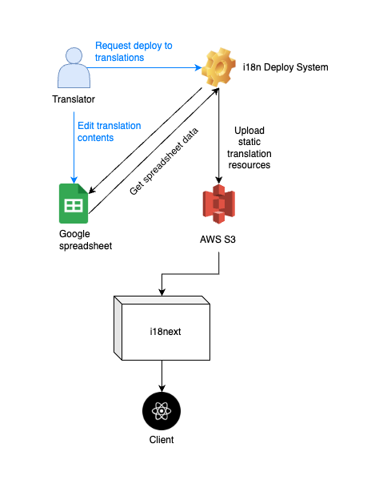

**국제화(Internationalization; i18n)**란 프로그램을 다양한 언어, 지역 등에서 서비스할 수 있도록 설계하는 것을 의미합니다. **지역화(Localization; l10n)**라는 단어도 있는데요. 국제화는 특정 지역이나 언어에 종속되지 않도록 설계하는 것을 의미한다면 지역화는 특정 지역, 문화권의 특성과 제도 등을 반영하여 서비스를 개발하는 것을 말합니다. 단순히 통화를 한국에서는 원화로, 미국에서는 달러로 사용하도록 개발하는 것마저도 현지화라고 부를 수 있습니다. 이러한 특성 때문에 이 두 단어는 보통 ["국제화와 지역화"](https://ko.wikipedia.org/wiki/%EA%B5%AD%EC%A0%9C%ED%99%94%EC%99%80_%EC%A7%80%EC%97%AD%ED%99%94)라는 단어로 함께 묶어서 표현하는 경우가 많습니다.

> 국제화와 지역화는 출판물이나 하드웨어 또는 소프트웨어 등의 제품을 언어 및 문화권 등이 다른 여러 환경에 대해 사용할 수 있도록 지원하는 것을 의미한다. 이때 국제화는 제품 자체가 여러 환경을 지원할 수 있도록 제품을 설계하는 것을 의미하며, 지역화는 제품을 각 환경에 대해 지원하는 것을 의미한다.<br/><br/>
>
> 🔗 ["위키백과 - 국제화와 지역화"](https://ko.wikipedia.org/wiki/%EA%B5%AD%EC%A0%9C%ED%99%94%EC%99%80_%EC%A7%80%EC%97%AD%ED%99%94)

이 글에서 소개하는 국제화 케이스는 "다국어 지원"에 초점이 맞추어져 있습니다. 이 글은 TOAST 기술 블로그의 [국제화(i18n) 자동화 가이드](https://ui.toast.com/weekly-pick/ko_20210303)에서 많은 영감을 받았습니다.

### Prerequisite

본문에서 언급되지만 자세히 설명하지 않고 넘어가는 것들입니다.

- 18next
- i18next-http-backend
- Next.js
- [Lokalize](https://lokalise.com/)

# 1. 국제화를 지원하는 방법

### 라이브러리

저는 국제화 지원을 위해 [i18next](https://www.i18next.com/)을 사용했습니다. 국제화하면 대표적으로 언급되는 국제화 프레임워크인데요. react, vue, jQuery 등과 호환되고, 백엔드에서도 사용할 수 있습니다. [react-i18next](https://github.com/i18next/react-i18next), [next-i18next](https://github.com/i18next/next-i18next)와 같이 각 개발 환경에 맞는 wrapper도 충분하게 제공됩니다.

`i18next`의 또 다른 장점은 플러그인에 있습니다. 브라우저 언어를 인식하여 자동으로 언어를 선택해주는 `languageDetector` 플러그인이나 MongoDB, Node file-system과 같이 외부 리소스와 연결시켜주는 `i18next-http-backend`와 같은 라이브러리들이 대표적입니다.

### 번역 콘텐츠

번역 콘텐츠는 개발 환경마다 조금씩 차이가 있을 수 있지만 대부분 언어별, 네임스페이스별로 분류하여 json이나 yml 형식의 정적 파일로 만들어 관리합니다. `i18next`와 같은 라이브러리는 이러한 번역 컨텐츠를 불러와 문자열을 치환해주는 역할을 하는 것이죠.


이러한 번역 콘텐츠는 `i18next`에서는 Resource라고 표현합니다. 이 Resource는 레포지토리 내에서 정적 파일로 관리할 수도 있고, 데이터베이스나 다른 외부 저장소에서 리소스를 동적으로 불러올 수도 있습니다.

```ts
i18next.init({
  lng: "en",
  resources: {
    en: {
      translation: {
        key: "value of key",
        look: {
          deep: "value of look deep",
        },
      },
    },
  },
});
```

# 2. 기존 방식의 문제점

번역 콘텐츠는 하나의 레포지토리 안에 정적 파일로 관리하는 것이 일반적이라는 것을 알았습니다. 그렇다면 이 방식이 가지는 문제점과 그 문제로 인해 발생하는 요구사항을 정리해볼까요?

### 문제점

- 1️⃣ 비개발자가 다루기 어렵다.
- 2️⃣ 번역 수정사항이 발생하면 매번 빌드와 배포를 거쳐야 한다.
- 3️⃣ 레포지토리마다 관리하기 때문에 번역 콘텐츠의 중복이 발생할 수 있다.

### 요구사항

- 1️⃣ 비개발자가 사용할 수 있는 관리툴을 제공해야 한다.
- 2️⃣ 번역가가 직접 번역물을 배포할 수 있어야 한다.

여기서 우리는 특별한 키🔑 포인트를 찾을 수 있는데요. 바로 **비개발자와의 협업**입니다. 국제화는 개발자가 진행하지만 그것을 가능케하는 번역 작업은 모두 전문 번역가가 진행하는데요. 이로 인해 비개발자가 쉽게 번역물을 관리할 수 있는 환경을 제공해주는 것은 거의 필수적이라고 할 수 있습니다. 솔직한 심정으로 이왕이면 이들이 개발자를 '덜 귀찮게' 했으면 하는 마음도 있었습니다.

# 3. 솔루션

### 1️⃣ 비개발자가 사용할 수 있는 관리툴을 제공해야 한다.


i18n 초기 세팅 중에 발견한 글이 정말 많은 도움이 되었는데요. 바로 TOAST 기술 블로그의 [국제화(i18n) 자동화 가이드](https://ui.toast.com/weekly-pick/ko_20210303)입니다. 이 글에서 구글 스프레드시트로 번역 콘텐츠를 관리하고 Google API를 통해 데이터를 추출하여 i18n resource로 변환하는 등의 내용이 소개되었는데요.

물론 [Lokalize](https://lokalise.com/)와 같은 완성형 번역물 관리 프로그램을 사용하는 방법도 있었습니다. 하지만 Lokalize는 해외 서비스라 속도가 느리고 생각보다 사용성이 떨어지며, 비용까지 발생하여 선정하지 못했습니다. 그 외에도 직접 사내 인프라를 구축하는 방법도 거론되었지만 배보다 배꼽이 더 나오는 격이라 TOAST의 아이디어를 적극 참조하여 구글 스프레드시트를 관리 툴로 선정했습니다.


구글 스프레드시트를 사용하면서 함수의 도움이 꽤나 쏠쏠하기도 했는데요. 중복된 값이 있으면 표시해준다던지, 번역 함수를 사용하면 자동으로 값을 번역해준다던지 등 함수의 활용도 또한 생각보다 높았습니다.

### 2️⃣ 번역가가 직접 번역물을 배포할 수 있어야 한다.

이게 가능하기 위해서는 번역 리소스 자체가 서비스 패키지로부터 분리되어 있거나 비개발자들이 서비스 배포를 쉽게 할 수 있던지 해야 합니다. 하지만 후자는 위험하죠. 배포 자동화가 이루어졌다고 하더라도 배포에 대한 권한을 개발팀 이외 인력에게 위임하기에는 위험성이 따릅니다.

따라서 번역물만 별도로 배포할 수 있는 시스템을 구축해야 했는데요. 저희는 이것을 **국제화 원격 배포 시스템**이라고 부르기로 했습니다.


**국제화 원격 배포 시스템**은 [Next.js](https://nextjs.org/)로 개발되었는데요. Next.js를 사용한 이유는 서버 사이드 렌더링이기 때문에 로직이 거의 노출되지 않는다는 점과 API 기능을 통해 백엔드 서버를 별도로 구축하지 않고 자체적으로 백엔드 API를 만들 수 있다는 점 때문에 선정하게 되었습니다.



기능은 아주 간단합니다. 번역물을 담당하는 직원이 **'배포하기'** 를 실행하면 백엔드 서버가 구글 스프레드시트에 접근하여 데이터를 추출하고, JSON 형태로 변환하여 최종적으로 **AWS S3**에 파일을 업로드하는 과정을 진행합니다.

이렇게 S3에 배포된 Resource를 `i18next-http-backend` 플러그인을 통해 불러와 사용하는 것이 저희가 구축한 국제화 시스템의 Flow입니다.

# 국제화 원격 배포 시스템

이름이 좀 거창하죠? 사실은 그렇게 대단하진 않습니다. 백엔드를 별도로 만들기 귀찮아서 Next.js의 백엔드 API 기능을 사용했고, 구글 스프레드시트를 불러와 json 파일로 변환해서 S3 업로드하는 기능 밖에 없습니다.

이렇게 항목을 추가하면서까지 더 이야기하고 싶었던 것은 이 시스템을 만들게 된 배경입니다. 위의 이야기로 충분하지 않냐구요? 그럴 수도 있습니다. 하지만 더 이야기하지 못한 부분들이 있습니다.

우리가 실제로 기술 개발을 해보면 항상 낭만만을 추구할 수는 없다는 사실을 금새 깨닫게 됩니다. 심지어 명확한 기술적 근거와 판단만이 해법이 되지 않기도 합니다. 이 시스템은 그렇게 지극히 비즈니스적인 접근에 의해 탄생했습니다. 한정적인 리소스를 측정하고, 그 리소스로 최대의 효율을 낼 수 있는 방법을 고민한 결과물인 것이죠.

### 한정적인 리소스, 최대의 효율

국제화 작업의 분량은 생각보다 컸습니다. 지원해야 하는 국가가 많았을 뿐더러 물리적인 코드량이 상당히 방대했기 때문이죠. 그럼에도 불구하고 일정은 촉박했습니다. 물론 일정이야 어떻게든 조율해볼 수 있는 부분이었지만 전체 코드를 한 번에 수정하는, 어찌보면 대규모 리팩토링 작업이었기 때문에 개발팀 전원이 참여했어야 했는데요.

시간이 길어질수록 다음 일정이 미루어지고, 작업자들의 피로도가 증가했기 때문에 `일을 위한 일`에 너무 많은 리소스를 투입할 수는 없었습니다. "한 명의 개발자가 하루 이틀 붙어서 만들 수 있을 수준으로 가장 최소 단위의 인터널 프로덕트를 만들어서 업무를 최적화해보자."라는 결론이 서더군요.

그렇게 탄생한 것이 **국제화 원격 배포 시스템**입니다. S3가 아니라 레포지토리에 배포를 하게 한다던지, 국제화에 최적화된 번역 콘텐츠 관리툴을 만든다던지, 다채널, 버전관리 등을 가능하게 한다던지 등도 시도해보고 싶지만 안타깝게도 현실은 그런 낭만까지는 허락하지 않았습니다.

# 마치며

결과적으로 저희는 적은 개발 리소스를 투입하여 만든 시스템을 통해 비개발자들에게 가장 친숙한 형태로 번역 콘텐츠를 관리할 수 있었고, 개발적으로도 관리 포인트를 줄일 수 있게 되었습니다. 번역 콘텐츠와 서비스를 따로 배포하는 이 구조는 마이크로서비스의 관점이 반영된 결과라고도 볼 수 있습니다.

혹 비슷한 사례가 없을까하여 찾아보던 중 [Dable의 다국어 지원 시스템](https://teamdable.github.io/techblog/I18n-system-in-dable)이라는 글이 눈에 띄더군요. 2021년도 글인데 이미 이때부터 국제화 관리의 니즈는 계속되어 왔던 것 같습니다. 회사에서 진행했던 프로젝트에서는 이 이상 도전해보지 못했던 것들을 오픈소스로 계속해보려고 합니다. 개인적으로는 [Lokalize](https://lokalise.com/)와 같은 형태를 구상해보고자 하는데요. 관심있으신 분들은 함께 의견을 나누어 보이는 것도 좋을 것 같습니다.

읽어주셔서 감사합니다. 다음에는 개발 이야기와는 조금 다른, 스타트업과 서비스에 대한 이야기로 찾아뵙도록 하겠습니다.

# 참고

- [국제화(i18n) 자동화 가이드 | TOAST](https://ui.toast.com/weekly-pick/ko_20210303)
