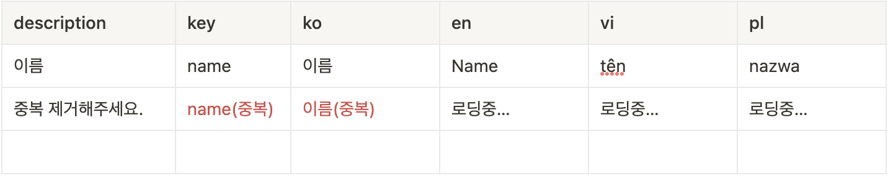

이번 글에서는 신규 글로벌 사업 준비에 발맞춰 개발팀이 어떤 준비를 했으며, 외부 번역 인력들과의 협업을 어떤 식으로 풀어 나갔는지 그 히스토리를 공유해보려고 합니다. 본문에서 소개하는 내용들은 TOAST 기술 블로그에 올라온 [국제화(i18n) 자동화 가이드](https://ui.toast.com/weekly-pick/ko_20210303)에서 많은 도움을 받았습니다.

국제화 작업을 위해 사용된 스택은 다음과 같습니다.

- 구글 스프레드시트
- 18next
- i18next-http-backend
- Next.js

# 국제화를 위한 프론트엔드 기술

국제화 지원을 위해 저희는 `i18next`를 사용했습니다. `i18next`는 `t`라는 번역 메서드를 제공하는데요. 이 메서드의 인자로 `key`를 주입하면 언어에 맞는 번역된 문자열을 반환합니다.

```tsx
const LOCALES = {
  submit_button_text: "전송하기",
};

const translation = i18next.t("submit_button_text");
// '전송하기'
```

`react-i18next`를 사용하면 리액트 프로젝트에서 `i18next`를 보다 쉽게 사용할 수 있습니다. 아래와 같이 사용할 수 있습니다.

```tsx
import { useTranslation } from "react-i18next";

const SubmitButton = () => {
  const { t } = useTranslation();
  return <button>{t("submit_button_text")}</button>;
};
// <button>전송하기</button>
```

# 번역 데이터 관리 방법 선정

국제화를 위한 라이브러리를 선정했다면 이제 코드 상에 하드코딩되어 있던 문자열들을 JSON 형태의 데이터로 옮기고, `t` 메서드를 사용하여 코드 상에 매핑해주는 작업을 진행해야 합니다.

```tsx
// 1️⃣ 기존
<button>전송하기</button>;

// 2️⃣ 데이터화
const LOCALES = {
  submit_button_text: "전송하기",
};

// 3️⃣ 매핑
<button>{t("submit_button_text")}</button>;
```

여기서 우리는 이 번역 데이터를 관리하는 방법을 정해야 했는데요. 리서치를 통해서 찾아냈던 후보군은 세가지였습니다.

### 1️⃣. 프로젝트 내에서 관리


**장점**

- 버전관리에 유리
- 개발자가 직접 관리함
- 성능적으로 유리함

**단점**

- 개발자가 직접 관리함(!)
- 비개발자가 접근하기 어려움

### 2️⃣. 구글스프레드시트로 관리 ✅

**장점**

- 동시 작업 가능
- API 제공 (자동화에 유리)

**단점**

- 작업자의 실수로 데이터가 유실될 수 있으며, 버전관리가 어려움
- API에 대한 러닝커브, 자동화 구축 직접해야 함

### 3️⃣. 솔루션 사용([Lokalize](https://lokalise.com/))

**장점**

- 동시 작업 가능
- 자동화 기능 제공

**단점**

- 해외 서비스라 느리다.
- 유료 서비스다.
- 의존적임.

[Lokalize](https://lokalise.com/)는 다국어 대응을 위한 자동화 도구이자 플랫폼입니다. 동시작업은 물론이고 번역된 결과물을 미리 확인해볼 수 있는 프리뷰 기능, Figma와 같은 외부 디자인 툴에서 번역물을 불러와 시안에 적용할 수 있는 기능과 같이 다양한 부가 기능을 제공합니다.

# 구글스프레드시트로 협업

최종적으로 저희는 **구글스프레드시트**로 번역물을 관리하기로 결정했습니다. 구글스프레드시트의 **동시작업** 기능이 너무 매력적이었고 무엇보다 무료라는 점, API를 통해 확장 가능하며, 구글만이 제공할 수 있는 전용 함수(구글 번역 등) 등의 활용도가 높았기 때문입니다.

그렇게 저희는 전사적으로 투입 가능한 인력들을 최대한 끌어모아 화면 상에 존재하는 문자열들을 상당히 무식한(…) 방법으로 구글 스프레드시트에 옮겨 담았는데요. 많은 인력이 투입되었기 때문에 데이터화 작업은 하루 만에 끝이 날 수 있었습니다. 결국은 이 데이터를 개발자에 의해 후가공하는 과정을 거쳐야 했습니다만, 개발팀 인력을 모두 데이터화 작업에 투입하는 것보다는 이 방법이 비용, 시간적인 측면에서 유리했습니다.



우리는 이 시트의 효율적인 관리를 위해 몇가지 함수를 적용했습니다. 가장 먼저 항상 유니크해야 하는 key값의 중복을 체크하고, 불필요한 엔티티의 발생을 잡기 위해 한국어 값의 중복도 함께 체크했습니다. 저희의 경우 처음부터 11개국어를 지원해야 했다고 말씀드렸는데요. 이 엄청난 양의 문자열들을 번역하기 위해 인력을 투입하기에는 11개국 모두를 집중적으로 투자할 것은 아니었기 때문에 주요 대응 타겟이었던 영어, 베트남어, 폴란드어를 제외한 나머지는 구글 스프레드시트가 제공하는 번역 함수를 사용했습니다.


이 번역함수의 구성은 꽤나 재밌는 부분이 있는데요. 한국어를 먼저 영어로 번역하고, 이 번역된 값으로 나머지 언어들을 자동 번역합니다. 물론 워낙에 데이터가 방대하기 때문에 항상 번역이 돌아가도록 하진 않고, 작업이 완료된 시트는 함수를 제거하여 ‘정적인’ 상태로 바꿔주는 작업을 진행했습니다. 이렇게 하지 않으면 구글 스프레드시트가 뻗거든요(…).


또한 저희는 도메인 단위로 분리된 각 시트들의 상태를 한 번에 모니터링할 수 있는 대시보드 페이지를 만들었습니다. 실제로 저희 서비스의 번역을 담당해주고 있는 협력 업체들이 이곳의 업데이트 상황을 보고 번역이 필요한 시트를 찾아 실시간으로 번역 작업을 진행해주고 있습니다.

# 실시간성이 결합된 국제화 파일 자동화

실제로 우리가 화면에 적용해야할 문자열들을 정리하고, 번역하는 작업은 끝났습니다. 그렇다면 이 데이터를 어떻게 활용해야 할까요? 우리는 그 해답을 다시 한 번 구글 스프레드시트에서 찾았습니다. 구글은 외부에서 스프레드시트에 접근할 수 있도록 API를 제공하는데요.

저희는 `Next.js`를 사용하여 구글 스프레드시트와 연동되는 **국제화 원격 배포 시스템**을 만들기로 했습니다. `Next.js`를 선정한 이유에는 SSR이기 때문에 로직이 거의 노출되지 않는다는 점과 API Page 기능을 통해 백엔드 API를 개발할 수도 있기 때문이었는데요. 접근 권한이 있는 관계자가 해당 페이지에 접근하여 **'배포하기'** 버튼을 클릭하면 백엔드 서버가 구글 스프레드시트에 접근하여 데이터를 추출하고, JSON 형태로 변환하여 최종적으로 AWS S3에 파일을 업로드하는 과정을 진행합니다.

이렇게 정적화된 파일들은 그대로 다운로드 받아서 각 프로젝트마다 사용할 수도 있는데요. 이미 자사 네이티브 앱에서는 위 스크린샷의 배포 페이지를 통해 각 언어별, 개발 환경별 언어 파일을 내려받아 사용하고 있습니다.


여기서 흥미로운 점은 S3에 JSON 파일을 업로드한다는 점인데요. 이 점이 바로 저희가 이것을 **'배포 시스템'**이라고 부르는 이유입니다. 실제로 번역 데이터를 관리하다보면 사소한 오타 수정부터 신규 기능 개발건을 위한 번역 작업 등 다양한 이유로 **‘잦은 배포’**가 일어나는데요. 만약 저희가 변환된 JSON 파일을 프로젝트마다 복사하여 사용하고 있었다면 개발자의 일정에 **'번역 데이터 배포'**라는 업무가 추가되었을 겁니다.


이러한 문제를 방지하기 위해서 비개발자로 분류되는 번역 담당자들이 번역 데이터의 배포를 직접 핸들링할 수 있도록 해야 했는데요. 저희는 그 해답을 `i18next-http-backend` 라는 `i18next` 플러그인에서 찾았습니다. 이 플러그인을 사용하면 외부 경로에 존재하는 국제화 파일을 불러올 수 있게 됩니다. `react-i18next`의 `useSuspense` 옵션을 사용하면 국제화 파일을 불러오는 동안 로딩화면을 표시하는 것도 가능합니다.

# 결과

결과적으로 비개발자들이 쉽게 관리할 수 있는 인터페이스를 구축하고, 실시간으로 번역물을 서비스에 반영할 수 있게 되었습니다. 언어와 코드를 따로 배포하는 이 구조는 마이크로서비스의 관점이 반영된 결과라고도 볼 수 있습니다.

하지만 아쉬운 점은 분명히 존재하는데요. 단시간 안에 이루어내야 했던 과제였기 때문에 이와 같이 생산성을 위한 연구 기간이 매우 부족했습니다. 빠르게 생각하고 빠르게 만들어내야 했기 때문에 아주 가벼운 수준의 기능만을 담고 있는데요. 무엇보다 국제화 파일에 대한 버전관리가 되지 않기 때문에 국제화 이후에 몇가지 애로사항들이 생기곤 했습니다.

# 참고

- [국제화(i18n) 자동화 가이드 | TOAST](https://ui.toast.com/weekly-pick/ko_20210303)
