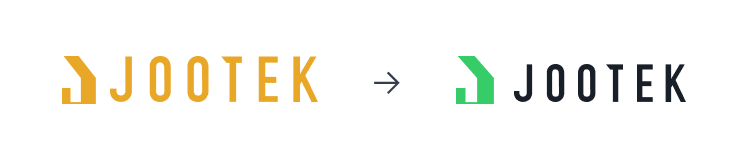
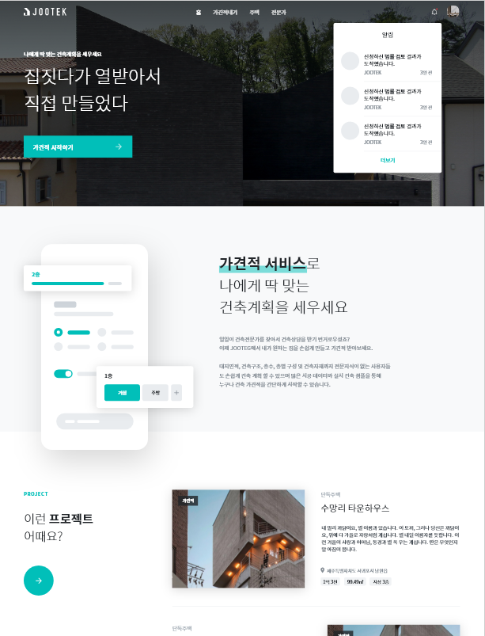
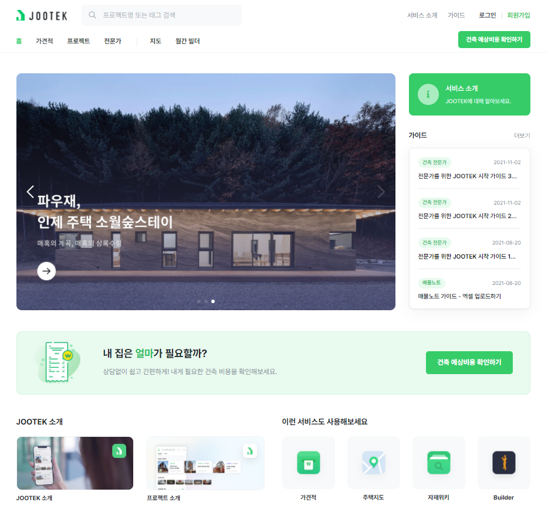
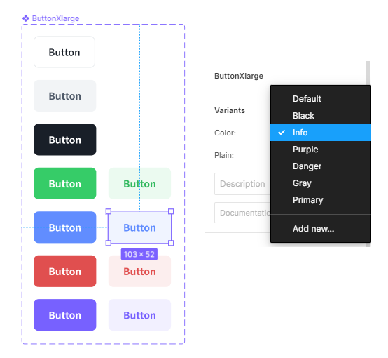
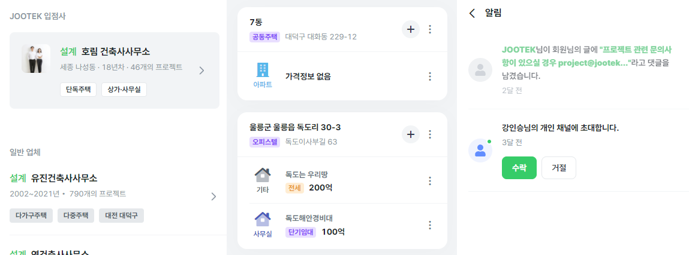
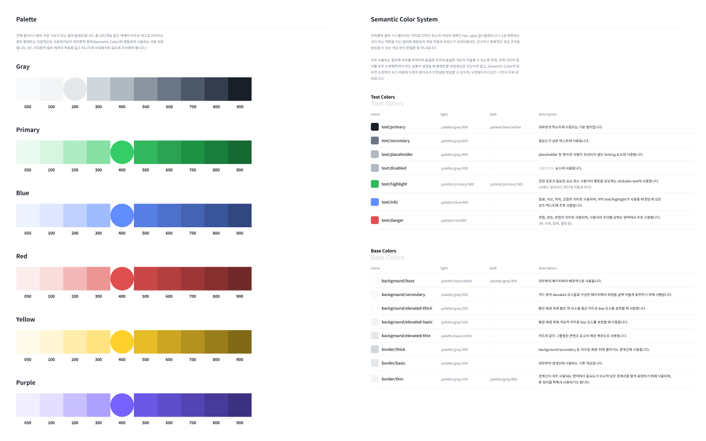

다사다난했던 지난 날을 뒤로 하고 드디어 2022년 새해가 다가왔다.

Happy New Year, 나 자신.

많은 일들이 있었고, 많은 변화가 있었지만 나는 이렇게 어엿한 3년차 Front-End 개발자가 되었다. 2021년 초부터 협업을 하기 시작했던 스타트업에 입사를 하게 되어 디자인과 개발을 병행했으며, 많은 결과물을 만들어냈다. 다만 아쉽게도 개인과 회사의 성장은 동일하지 않기 때문에 나는 더 나은 성장 방향성을 잡기 위해 회사를 그만두고 나왔다.

오늘은 그간 JOOTEK 이라는 스타트업에서 근무하며, UI/UX부터 시작하여 브랜드 컬러 재정립, 디자인 시스템 구축, React 기반 프로젝트의 대규모 리팩토링까지 다양했던 경험들을 소개해보려고 한다.

## 컬러부터 시작하는 브랜드 이미지 개선

###### 리뉴얼 전(왼쪽), 리뉴얼 후(오른쪽), (기존 로고는 자료를 찾을 수 없어 기억에 의존하여 임의로 만듬)

지금도 썩 마음에 드는 로고는 아니지만 예전부터 BI, CI는 절대로 건드리지 않겠다고 다짐했기 때문에 전체적인 형태는 건드리지 않았다. 지금의 변화점도 사실 디자인을 위해 어쩔 수 없이 건드렸던 부분이다.

기존의 로고는 심볼의 비율이 안정적이지 않았고, 심볼과 로고의 형상 자체가 높이를 맞추면 언밸런스해보이기 때문에 일부 시각보정과 비율 개선이 들어갔다. 또한 다소 올드(Old)하고 서비스와의 연관성도 딱히 없는 주황색 컬러는 브랜드 이미지와 디자인 개선을 위해 변경이 불가피했다.

지금의 색상을 만들어내기까지 상당한 시간이 걸렸다. 세련되고 신뢰감을 줄 수 있는 브랜드 컬러가 필요했지만 경쟁업체가 이미 파란색을 사용하고 있다는 이유로 푸른 계열의 색상을 사용할 수 없었으며, 당시 브런치와 같은 디자인을 선호했던 대표님의 취향과 입김이 반영되어 하늘색과 녹색의 중간 단계, 옥색에 가까운 컬러를 사용했었다. 건축물과 떼어놓을 수 없는 자연적 요소와 안락한 보금자리를 상징하는 초록색과 신뢰를 상징하는 파란색을 섞은 결과이다.

하지만 쨍한 컬러가 유행하는 이 시점에서 애매한 색상은 호불호가 갈렸고, 무엇보다 하나의 컬러 코드를 다양한 곳에서 사용하기에는 색상 자체가 대비가 높지 않다보니 면에 사용하면 지나치게 눈에 띄고, 텍스트에 사용하면 가독성이 떨어지는 문제가 생겼다. 때문에 3차 리뉴얼을 거치면서 서비스의 모든 디자인 언어를 새롭게 바꾸게 되었고, 이를 통해 지금의 네X버가 떠오르는 정직한 녹색이 채택되었다. 또한 유색이 들어가면 과하게 붕 뜨는 로고의 특성을 개선하기 위해 심볼에만 브랜드 컬러를 적용하도록 하여 산뜻한 느낌을 유지하면서도 로고의 색상이 붕 뜨지 않고 단단하게 자리잡을 수 있도록 했다.

## 플랫폼과 마켓플레이스를  사랑한 디자이너의 메인페이지

###### 2차 리뉴얼 메인

###### 3차 최종 리뉴얼 메인

솔직히 지금도 만족스럽지 않은 결과물이긴 하지만 드디어 의사결정자들이 내 디자인 언어를 이해하기 시작했으며, 궁극적으로 기업의 얼굴을 바꾸게 된 계기는 바로 메인페이지였다.

메인페이지는 고객들이 처음으로 만나는 서비스의 첫인상이다. 그리고 재방문자들이 항상 거쳐가는 관문이기도 하다. 건축사들의 건축 포트폴리오가 올라오는 플랫폼 서비스인 만큼 초기부터 플랫폼스러운 디자인을 주장했지만 의사결정자는 이를 이해하지 못했다.

"사람들은 우리 서비스를 잘 모르니 메인에서 서비스를 설명하는 섹션이 필요합니다.", "건축가들은 까다롭기 때문에 자신들의 포트폴리오가 올라오는 곳은 예술적이게 보여야 합니다." 등의 의견들이 반영되어 비주얼적인 기교와 불필요한 정보로 난도질당한 메인 시안이 탄생했는데 사실 블로그에 썸네일로 첨부하는 것조차 수치스러울 정도로 불쾌한 결과물이었다.

<strong>자고로 플랫폼은 플랫폼 다워야 한다.</strong> 나는 그렇게 생각한다. 플랫폼 서비스, 슈퍼앱, 마켓플레이스, 커뮤니티 커머스···. 내가 좋아하는 단어들이다. 내가 입사할 회사를 고를 때 중요한 요소로 작용하는 것들이기도 하다. 그만큼 나는 이 서비스들이 어떤 얼굴을 하고 있어야 하는지에 대해 나름의 답을 가지고 있다. 이 단어들이 들어간 서비스들은 모두 그들이 팔고자 하는 것들, 이 서비스에서 고객이 원하는 것들을 메인에 노출시킨다. 그것들은 컨텐츠가 되기도 하고, 제품이 되기도 한다. 즉, 무엇을 셀링할지가 메인에서 바로 드러난다는 것이다.

JOOTEK은 건축가와 건축주를 잇는 플랫폼을 지향한다. 현 시점에서 이 사이트를 방문하는 고객들의 니즈는 무엇보다 건축가의 포트폴리오를 구경하는 것에 있을 것이고, 기업 또한 이들을 셀링하는 것에 목적을 두고 있다. 그러나 서비스를 소개하는 것에 과하게 힘을 주었고, 판매하겠다는 컨텐츠는 고작 세 개 밖에 보여지지 않는다는 것은 제품을 팔지 않겠다는 것이나 다름없다. 고객들에게 제품보다 회사 연혁을 먼저 읊어주는 기업은 없을 것이다. 무엇보다 서비스 소개를 줄줄이 나열해야 알아먹을 수 있는 디자인이 과연 제대로된 디자인이라고 할 수 있을까?

다행히도 여러 차례의 시안들을 통해 대표님도 결과물이 만족스럽지 않다는 것을 깨달았고, 이 시점 이후로 JOOTEK의 디자인은 대대적인 변화를 맞이했다. 대표님이 싫어했던 요소들은 대략 이렇다.

둥글둥글한 요소, 영하게 컬러풀한 색상, 플랫폼스럽게 격자식으로 나열된 요소들, 예상되는 레이아웃 구조. 사실 전부 내가 좋아하는 것들이다. 디자인 트렌드는 점점 둥근 쉐잎을 강조하는 형태로 진화하고 있고, 색상이 주는 임팩트는 색상 자체로 기업을 표현할 수 있을 만큼 뚜렷해야 하며, 플랫폼은 더더욱 진부할지라도 예상 가능한 형태를 갖추고 친근한 방식으로 고객에게 다가가야 한다.

새로운 디자인 룩앤필과 서비스에서 컨텐츠로 옮겨간 메인 페이지의 대주제는 이 서비스가 어떤 것들을 셀링하는지 명확하게 보여주었으며, 고객에게 더 다양한 선택지와 볼거리를 제공했다. 무엇보다 이를 통해 줄줄이 서비스를 소개할 필요없이 자연스럽게 고객이 플랫폼의 다양한 서비스들을 찾아보고 직접 사용해보며 서비스를 학습할 수 있게 되었다.

## 디자인 시스템

디자인을 진행하면서 자연스럽게 브랜드의 이미지가 개편되었고, JOOTEK의 디자인 컨셉이 결정되었으며, 이를 통해 JOOTEK의 서비스들은 일정한 패밀리룩을 띄게 되었다. 하지만 메인 플랫폼 외에도 지도, 가견적, 매물노트, 스마트폴리오 등 JOOTEK이 개발하는 다양한 서비스들은 각자 조금씩 다른 룩앤필을 가지는 문제가 있었다. 디자인이 정립되어가는 과도기에는 메인 서비스과 부가 서비스들의 디자인이 다소 상이했으며, 새롭게 개발되는 서비스들의 디자인이 기존 디자인을 너무 압도적으로 씹어먹는 일도 비일비재했다. 이를 해결하기 위해서는 정해진 언어로 디자인이 작성되도록 하는 것이 중요했다.

3차 리뉴얼부터는 더 나은 디자인 프로세스와 디자인 시스템을 염두해두고 Adobe XD에서 Figma로 디자인 툴을 변경하는 과정을 거쳤다. 다행히 나는 회사에서 디자인 영역을 총괄하고 있었고, 그 디자인을 코드로 옮기는 과정 또한 Front-End인 내가 직접했기 때문에 가능했던 일이다. 대부분의 조직들은 toss같이 특이점이 온 회사(지속적이고 빠른 변화를 추구)가 아니라면, 툴을 변경하는 작업은 결코 쉬운 일이 아니다.

Figma로 디자인 툴을 교체하면서 기존에는 불가능했거나 불편했던 것들이 해소되었는데 무엇보다 JDS(JOOTEK Design System)라는 이름의 디자인 라이브러리를 배포하고 모든 디자인 시안들이 이를 기반으로 작성되도록 하는 것이 가능해졌다. Adobe XD도 물론 라이브러리 기능을 제공하지만 지금과 같은 강력한 연동성은 기대할 수 없었다.

JDS를 개발하면서 디자인 언어를 형태화할 수 있게 되었다. 무엇보다 Figma의 편의성과 더불어 필수적인 요소들이 미리 정의되어 있기 때문에 점점 수가 늘어나는 부가 서비스들의 디자인 생산성을 증가시키는 데에 큰 도움이 되었다.

무엇보다 JDS를 통해 구현된 요소들과 기능들은 실제 코드로도 구현이 되어 React의 대표적인 UI 라이브러리인 Ant Design처럼 어디서든 가져다 사용할 수 있고, 여러 편의 기능이 내장된 그야말로 도구화가 이루어졌다. 디자인과 개발을 병행하는터라 이 자체 UI 라이브러리에 대한 문서화도 덜 되었고, 때문에 JDS보다 실제 코드 베이스의 구현체가 대응할 수 있는 디자인 케이스들도 많고 기능도 더 다양하다. JDS에서는 형태만 잡혀있는 List 컴포넌트는 실제 코드에서는 JOOTEK 지도, 매물노트, 스마트폴리오 등 react를 사용하는 프로젝트에서 중추적인 역할을 하고 있다. 필요에 의해 만들었지만 그 활용성은 내가 봐도 놀라울 정도로 강력하다.

개인적으로 JDS의 꽃은 컬러 시스템이라고 생각한다. 10단계로 점진적으로 밝기가 증가하는 컬러 팔레트를 구성하고 그 컬러 팔레트를 기반으로 Semantic Color System(의미론적 컬러 시스템)을 만들었다. 맥락과 형태를 분리하면서 근본이 되는 컬러 팔레트를 수정하지 않아도 특정 맥락에 적용된 컬러만 변경하면 모든 시안에서 관련 요소들의 색상을 변경할 수 있다. 특히나 이 SCS를 적용하면서 가장 큰 이점은 다크모드를 가장 빠르게 구현할 수 있다는 것이다. 컬러 팔레트를 기반으로 다크모드를 구현하면 사실상 색반전 밖에 안되는데 이렇게 되면 요소들 하나하나의 색상을 또 다시 작업해줘야 하는 불상사가 생긴다. 그러나 모든 요소들의 컬러를 맥락별로 변수화하여 관리하면 단순 색반전으로는 해결되지 않는 문제들을 쉽게 해결할 수 있다.

이 의미론적 컬러 시스템을 적용하는 데에는 쏘카 블로그에 포스팅된 디자인 시스템 구축기가 많은 도움이 되었다.

---

이 글을 쓸까 말까 굉장히 고민했다. 풀기 시작하면 해야할 이야기가 산더미라서 분량조절에 실패할 것이 뻔했기 때문이다. 그래서 차라리 과감하게 디테일은 생략하기로 했다. 마치 그간의 1년을 요약하여 일기장을 쓰는 느낌으로. 이 경험이 누군가에게 도움이 될만한 것은 아닐지 모르겠지만 나 자신이 경험을 회고하는 용도로는 충분해 보인다. 다음 회사에서는 어떤 모험이 기다릴지, 그리고 지금까지의 경험이 어떠한 쓸모로 돌아올지 기대된다.

리액트에 대한 이야기도 하고 싶었지만 디자인 카테고리에서 할만한 이야기는 아닌 것같고, 이쪽도 나름대로 분량이 상당하기 때문에 압축하기가 힘들 것으로 보인다. 애초에 글로 쓸만한 물건이 아닐지도. 그저 개발 초심자가 터트려 놓은 병크를 밤새워가며 리뉴얼해서 자료 구조 개선하고 기초적인 개발 규칙을 공유했을 뿐이다. 심해에 빠진 프로젝트를 정상 궤도로 올려놓았을 뿐, 내 개발 커리어는 아직도 갈 길이 멀다.
