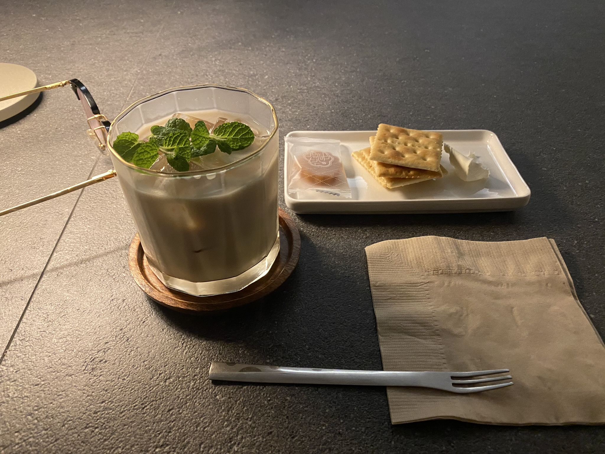
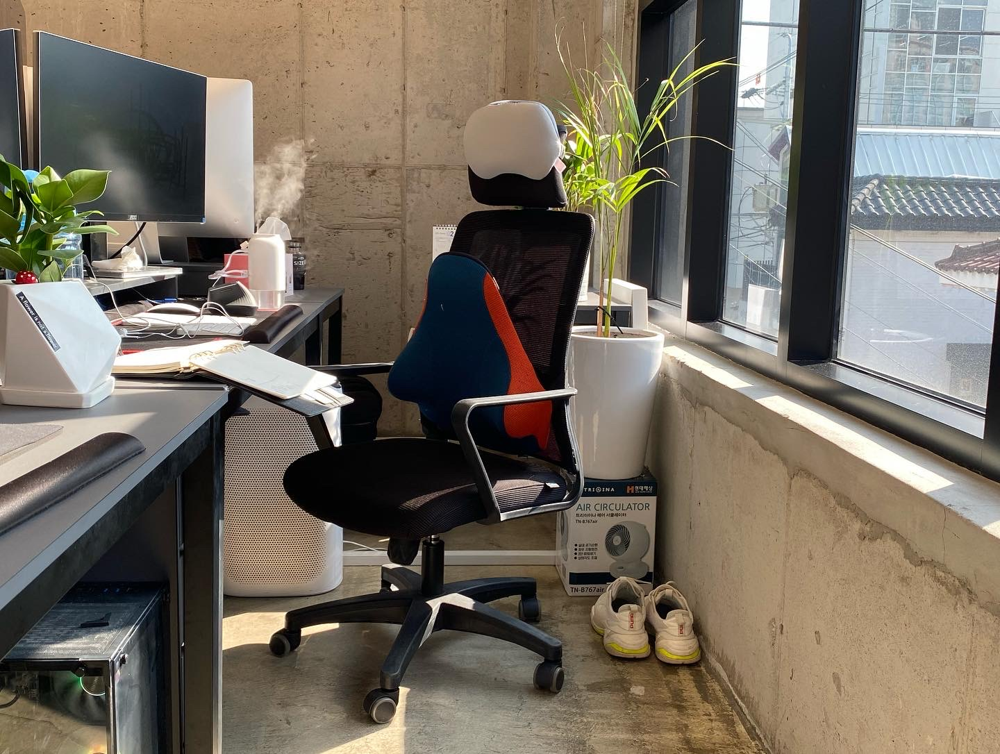
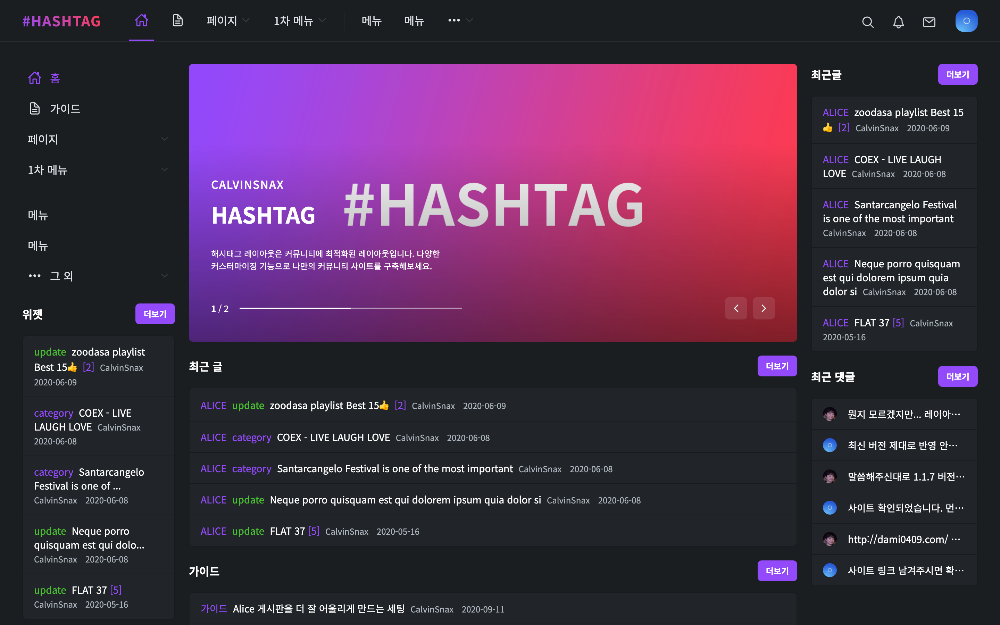

깔끔하고 간결하게, 또 아름답게 끝내고 싶었다. 취미로 시작했던 개발이 어느새 직업이 되었다. 3년 간의 시간동안 수차례 호스팅도 옮기고 리뉴얼도 거치고 잠깐의 공백과 새로운 소식들로 그 숨을 유지하던 이곳은 이제는 내게 애증의 공간이 되어버렸다.

# 빠르고 가파랐던, 우여곡절의 시기.

시작은 단순했다. 다니던 회사가 사정이 안좋아져서 때려치우고 나왔던 시기였다. 나름 통수도 맞고 통수도 치고 파란만장했던 IT 창업계를 떠나와 본가 대전으로 돌아왔다. 사회초년생이었지만 남들보다 빠르게 사회에 뛰어들어 적응했고 패배의 쓴맛을 맛보았던 청년은 얼마 안남은 20대 청춘을 불태우리라 다짐했다. 동경의 대상이었던 노래와 춤을 더욱 적극적인 취미로 만들었다. 친구들과 함께 댄스팀을 꾸려 잠깐이나마 '인싸'의 풍취를 맡고 평범한 20대 청년들과 마찬가지로 알바를 하고 나쁘지 않게 살았다. 디자이너의 꿈과 열정은 식지 않았기에 자기개발도 멈추지 않았다. 중간에 나름 돈 없는 청년에게는 큰 액수의 빚이 생겼었다. 친구에게 사기를 당했던 것이다. 이 사건은 많은 의미로 나를 좀 더 성장하게 만들어주었다. 그 만큼 잃은 것도 많지만 적어도 이후로 난, 성인이 되었다.

사기를 당하고 증거가 없어 경찰서에서도 해결해주지 못하고 부모님과의 갈등과 돈 문제로 암울했던 시기. 돈이 궁했던 시기지만 큰 충격과 스트레스로 우울증에 시달렸다. 아직도 그 시기에 내가 어떤 생각을 가지고 있었는지 무엇을 했는지는 기억이 나지 않는다. 꽤나 긴 시간이었는데 눈깜짝할 시간에 훅 지나갔다.

# 작은 날개짓이 모든 것을 바꿨다.

그렇게 방에서 나오지도 않고 컴퓨터만 붙잡고 살던 내가 어째선가 커뮤니티 사이트를 만들고 있었다. 물론 커뮤니티는 흥하지 못했다. 당시 생활코딩을 보며 만들었던 레이아웃과 위젯을 그냥 버리기는 아까웠기에 XE타운에 배포하게 되었다. 누가 알았을까. 그것이 내 개인 사업이자 취미가 되어버린 일의 시작이 될줄은.

그곳에 올린 내 레이아웃이 생각보다 호응이 좋았다. 지금은 다시 보면 참 마음에 안들지만 그 당시에 그렇게 그림자를 사용하고 정교한 애니메이션으로 떡칠된 레이아웃 자체가 조금 신선했을 것이다. 개발에 대한 확신이 없었기에 부족함을 느끼던 물건이었지만 사람들은 유료로 팔아도 살 것이라는 반응을 해주었다. 그래서 탄생한 것이 '이퀴어 테마 패키지'이다. 무료 버전의 이름을 그대로 계승하고 컨셉만 맞추고 코드부터 모든 것이 새로 만들어졌다. 개발된지 3년이나 지났지만 아직도 완성도는 나쁘지 않다고 생각한다. 나름대로 출시 당시에는 꽤나 센세이셔널했는지 잘 팔렸다. 얼리액세스 딱지를 붙이고 피드백이 오는 족족 업데이트를 해주었고 얼리액세스라는 일종의 프로모션 이벤트는 더더욱 사람들이 제품을 사게 만들었다. 거기에 추가금을 내고 프리미엄 라이센스를 사면 무제한으로 사용할 수 있다는 점도 지금 생각하면 잘 만든 가격정책이라고 생각한다.

그 시기에는 기대와 열정으로 가득찼고 감사하게도 제품을 판매한 수익으로 빚도 어느정도 갚아나가고 있었다. 차근차근. 이대로 포기하지 않고 달리면 다시 처음으로 돌아가 다시 시작할 수 있어. 희망과 기대로 매일매일이 행복했다. 서울에서 일하느라 자주 못보던 베프들도 자주 보고 내 삶에 부족했다라기 보다 자처해서 잃어버렸던 것들이 다시 채워져나가기 시작했다. 있던 것의 소중함을 크게 느끼던 시기였다.

# 취미가 일이 된다면?

그렇게 열정적으로 일을 벌려가던 시기에 취업 제의를 받았다. 사실 스타트업계는 이런 일이 비일비재하다. 스타트업 경험이 있는 젊은 인재라는 키워드 자체가 가성비 좋은 아이템이었으니까. 내 포지션 자체가 디자이너면서 구현의 도구로 코드를 선택한 희귀종이라 디자이너의 눈에 들어온 것이다. 말 잘듣는 개발자가 필요했겠지. 그렇게 내 직업은 디자이너였다가, 퍼블리셔였다가, Vue를 사용하는 프론트엔드 개발자로 발전했다.

이미 돈도 벌리고 있던 시기였기에 곧장 서울로 올라가 그들이 사무실겸 숙소라 주장하는 옥탑방에 안착했다. 온갖 일들이 있었고 스트레스와 소소한 다툼도 있었지만 망원동에 2억짜리 주택을 전세계약해서 사무실겸 숙소로 쓰고 투자와 대출을 받아 그 비싸다는 합정에 그럴싸한 사무실도 차렸다.

채광 하나 만큼은 기깔나던 합정 사무실.

그렇게 열심히 회사와 나 자신을 키워나가던 시기였기에, SNAX 스토어 일에 거의 손을 놓게 되었다. 피드백은 주기적으로 해주었지만 기능 업데이트는 고사하고 버그픽스 정도만 겨우겨우 할 정도였다. 일거수일투족을 함께하는 동료들의 눈치도 살펴야 했다. 당연하게도 스토어의 발길은 줄었다. 경쟁 상품들의 퀄리티도 괜찮았고 애초에 그 시기에 나는 이미 레거시로 점철된 RXE 씬을 반쯤 포기했었다. node.js 기반으로 최신 기술을 사용하던 풀스택 개발자가 XE 레이아웃을 만든다? 쉽지 않은 일이다. 돌아가면 지금껏 회사에서 쌓았던 커리어와 실력들이 의미없어지는 일이니까.

# 모든 것을 정리하고, 無로 돌아갈 시간

군대를 가야될 시기도 오게 되었고 대표의 삽질로 회사가 주춤하던 시기였기에 결국 이번 회사도 그만두게 되었다. 2년간의 시간. 가장 오랜시간 일했던 애증의 회사였다. 온갖 스트레스와 우울증까지 도지고 번아웃이 제대로 왔었다. 나는 일을 그만두고 스스로를 돌아보고 자신을 사랑하는 일들을 하기로 했다. 생각해보면 난 일을 그만두고 나면 크게 한 번 쉬는 기간을 산정한다. 꽤 오래 일했기 때문에 퇴직금을 두둑히 받고 쌓였던 빚을 갚았다. 남은 돈으로는 혼자 어디로든 여행을 떠나 퇴직금을 다 쓸 즈음 돌아와 군대를 갈 생각이었다. 그런데 하필 일을 그만두던 시기에 코로나가 터져버렸다. 참, 사람 일은 모르는 것이다.

남은 퇴직금으로 맥북을 샀다. 갖고 싶었던 아이폰 11 pro도 샀다. 여행도 못가는거 흥청망청 쓰고 놀기라도 하자. 좋아하는 술도 마시고. 그런데 나는 참 일을 못하면 좀이 쑤시는 타입인 것 같다. 기어코 신제품을 출시했다. Slow와 Alice. 나름의 실험적인 도전이자 야심작이었다. 반응은 좋았지만 코로나까지 터져버린 와중에 수익은 예전만 같지 않았고 감내놔라 배내놔라 하는 고객들의 부담스러운 피드백은 더더욱 스트레스가 되었다.

애초에 나름대로 크게 성장한 나에게는 XE의 개발환경 자체가 매우 못미더웠다. 그 보수적인 네이버조차 SPA를 쓰는데 XE와 라이믹스는 쓰지 못한다니. 쓸 수 있다고 말하는데, 못쓴다. 내가 말하는건 완전한 프론트와 백엔드의 분리를 말하는 것이다. 참... 나와는 성향이 맞지 않는 타입들이다. XE의 레거시 개발환경과 라이믹스의 신문물을 도입하고 기존에 고객들에게 못해줬던 일들을 하기로 했다.

그렇게 해서 탄생한게 바로 #HASHTAG 레이아웃. 나름 마지막 대미를 장식할 야심작이라고나 할까? 실험물질에 가까웠던 Slow와 레거시인 Equeer의 장점들만 흡수해서 새로 만든 레이아웃이다. Alice 게시판 스킨을 만들 때부터 정말 이게 마지막이겠구나 하고 유작을 남기듯 디자인에 공을 들였었다. #HASHTAG 레이아웃은 의도적으로 Alice 게시판 스킨과 어울리는 테마를 상정하고 만들었다. 이 둘을 보면 초창기 이퀴어 레이아웃과 에덴 게시판 스킨이 떠오르지 않는가? 신규 트랜드에 맞춘 세련된 디자인으로 재탄생된 이퀴어 레이아웃과 EDEN 게시판 스킨의 자식으로 생각했다면 맞다. 이 두 제품은 지난 3년간을 회고하면서 다시 쓴 Equeer이자 Eden이다. 이 두 제품처럼 내 삶도 지난 삶을 회고하면서 다시금 써내려 가려고 한다.

이 이후로 추가 개발 요청은 부탁인데 안해줬으면 좋겠다. 이제는 용돈벌이도 안되는 일이고 정말 정으로 하는거다. 내 고객들은 나에게 마치 팬과 같은 존재들이다. 나는 고객들을 돈벌이 수단만으로 보지 않았고 내 작품과 내 재능을 사랑해주는 팬으로 보았기에 가능했던 일들이었다. SNAX 스토어의 시작은 돈도 벌면서 취미생활하는 것이었기에 내 제품들은 하나같이 고유의 특징이 있고 고객들이 아무리 요청해도 완고하게 고집을 이어갔다. 내 신념이자 철학으로 만든 작품을 단순한 프로덕트로만 바라보지 않아줬으면 좋겠다. 내가 고객들을 고객 뿐만이 아닌 팬으로 바라보는 것처럼.

# 정말로 끝

여기까지, 길고 장황하기만한 내 감성팔이 글을 읽어줘서 고맙다. 필자는 이 글과 신제품을 마지막으로 상황을 보면서 무기한으로 제품 개발을 중단할 생각이다. 애초에 이곳에 뼈를 묻을 생각은 없었고 라이믹스 2.0이 오더라도 내가 바라는 최신 개발환경은 되지 않을 것이기에 언제든 떠날 준비를 했던 것이 사실이다. 나는 아직 젊은데 이런 구식 환경에 적응하면 결국 내 성장은 여기서 멈추게 될테니까. 그렇다고 신제품 덜렁 출시해놓고 사라지겠다는 말은 아니다. 무료 소스도 가볍게 준비해볼 생각이고 나름 해시태그 관련으로 유니버스를 구성할 생각은 하고 있다. 당분간은 유료 제품을 개발하지 않고 아무런 제한과 압박도 받지 않고 자유롭게 그림을 그리고 싶은 것 뿐이다. 물론 올해 출시한 Slow, Alice, #HASHTAG는 지속적으로 기능 개발과 업데이트를 진행할 예정이다. 솔직히 말하면 Slow는 더이상 뭘 바꾸기가 애매해서 크게 기대는 안하는 게 좋다. 내가 생각하는 완성품은 #HASHTAG와 Alice다. 그것만 알아두도록.

언젠가 우리가 같은 곳에서 다시 볼 수 있다면,

그것만으로도 기쁜 일이 될 것이다.

그럼 안녕.
